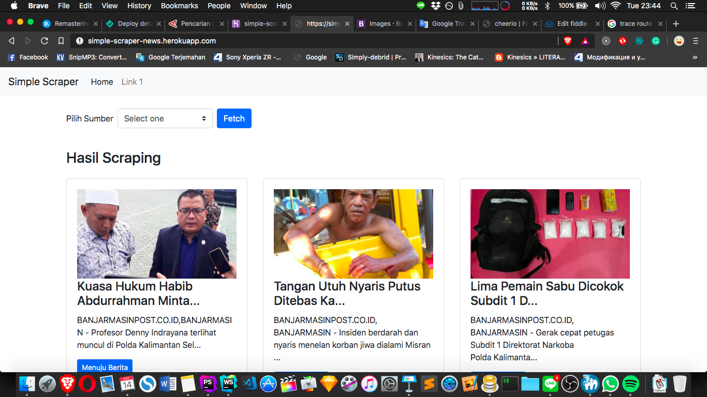

##Simple Scraping News
*How to install*
  1. make sure you already install node.js (LTS recommended)
  2. trough your cmd or terminal 
  type this
  
    npm install
    or
    yarn install
    
*How to use*
    
    type `node server.js` trough terminal / cmd
    goto localhost:8081 
    or 
    #DEMO
    simple-scraper-news.herokuapp.com
    / root homepage (GET)
    /scraping (view scraped data from url already defined) (GET)
    /scraping (fetching data from url and save to database) (POST)
    /news (view scraped data from database) (GET)
    
    
> use postman or insomnia to access /scraping with POST method

*Screenshot*
> fetching with dataType JSON

> fetching from web

  #####TODO:
  - [x] add Radar Banjarmasin
  - [x] add post param (dynamic scarping)
  - [x] add UI (make better UX)
  - [ ] add pagination for fetching more than one page
  - [x] cleaning the code, (index.js), still looking for param 
  - [ ] add custom config for database     
  - [ ] add loading animation while fetching data
  - [ ] fix error connect to db4free.net